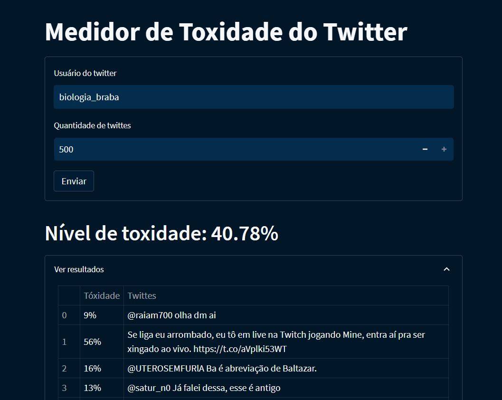
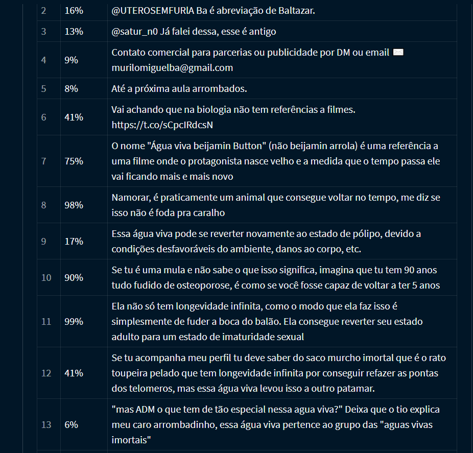

<h1 align="center">
Twitter's Toxicity Measurer ☠ 
</h1>

[TRY THE APP](https://toxidade-twitter.streamlit.app/) (streamlit free tier might ask you to reboot the app if it has been inactive for a while, do it and wait a little) 

This project aims to measure the level of toxicity of a twitter account (:brazil:) using a neural network model to measure toxicity levels from twittes. It was a project developed in the Neural Networks class from computer science course. UFAPE 2022.1 

 
Developers:
- MANOEL GUSTAVO GALINDO DE SALES
- JOANNE GABRIELA DOS SANTOS SILVA

 

 <h2>🤳 Screenshots</h2>

  

    
    
  

## 📜 About
  > **_NOTE:_** Since the model was trained with brazilian 🇧🇷 twittes, it will not have a good perfomance with other languages
  ### 🧠 Neural Network 
  The training data can be found here. It labels brazilian twittes as either toxic or non-toxic (1 or 0). Even though the training data has a normalized column of the twittes, we implemented our own.
  
  The model was developed using Keras and is very simple: 
  - An Embedding layer, followed by 
  - two SimpleRNNs and 
  - one simple layer to ouput a sigmoid activated prediction of toxicity from the given tweet.

  ### ☠ Application website
  The NN model was exported and we launched a [streamlit app](https://toxidade-twitter.streamlit.app/) using 
  [snscrape twitter](https://github.com/JustAnotherArchivist/snscrape) module to get twittes from the given account, we them feed these twittes to our model
  to predict the toxicity level of each one, calculate the average and display them for the user.
  
## 🛠 Getting started
> **_NOTE:_**  The requirements.txt file is used in streamlit deploy to install deps, it does not have the dependencies from the NN code notebook (`twitter-model/twitter-toxicity.ypnb`)
### ⚗ Dependencies
Install all dependencies with: `pip install pandas numpy nltk joblib scikit-learn tensorflow snscrape streamlit`
### 📁 Data folder
The `data` folder contaims: `twittes_data.zip` file which is the training data, `abbreviations_synonyms.py` file, a abbreviations dictionary used in the preprocessing step), 
a `POS_tagger_bigram.pkl` file also used in the preprocessing to tag the words. 

The `exported` folder has the exported model and tokenizer, so the [streamlit app](https://toxidade-twitter.streamlit.app/)
can use the model (as a black box that predicts toxicity levels)
